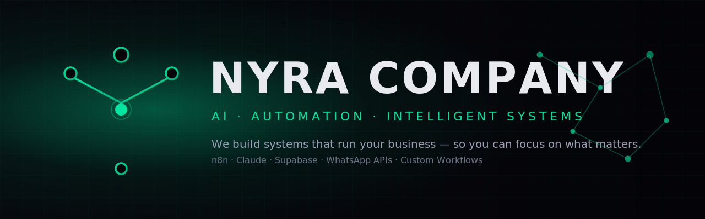

<!--
  Este README pertence ao repositório especial: NyraCompany/NyraCompany
  Ele aparece automaticamente na home pública do perfil em github.com/NyraCompany.
  Para ativar:
    1. Crie um novo repositório com o nome EXATO "NyraCompany" (público, com README).
    2. Substitua o README.md gerado pelo GitHub por este arquivo.
    3. Suba a imagem nyra-banner.png na raiz do repo (ou hospede no site).
-->

<h1>Nyra Company</h1>

<strong>Sistemas inteligentes que conectam o seu negócio.</strong> 
We build AI-powered automations that run your business — so you can focus on what matters.

  
  
  

---

### About / Sobre

**EN —** Nyra is a Brazilian AI automation studio. We design, engineer and ship intelligent systems that eliminate manual work, cut operational costs and let businesses scale without hiring more people. Think of us as the team that gives your operation an autopilot mode.

**PT —** A Nyra é um estúdio brasileiro de automação com IA. A gente projeta, constrói e entrega sistemas inteligentes que eliminam trabalho manual, reduzem custo operacional e fazem o negócio escalar sem precisar contratar mais gente. Pense na gente como o time que coloca a sua operação em modo piloto automático.

---

### What we build · O que entregamos

| | |
|---|---|
| **AI Customer Support** | Agentes de IA no WhatsApp, web e e-mail que respondem na hora, qualificam leads e resolvem problemas 24/7. |
| **Financial Automation** | Categorização automática de despesas, relatórios gerados sozinhos e insights de IA sobre seu fluxo de caixa. |
| **Smart Data & Sheets** | Conexão de fontes de dados, dashboards em tempo real, fim do trabalho manual em planilha. |
| **Custom Workflows** | Mapeamos seu processo exato e construímos a automação sob medida — integrada ao seu stack. |

---

### Featured projects · Projetos em destaque

**SmartFinance AI** — Sistema completo de gestão financeira com IA: categorização de despesas, insights inteligentes e relatórios mensais entregues via WhatsApp.
`n8n` · `Claude` · `Supabase` · `WhatsApp`

**ArenaFlow** — Gestão de quadras esportivas com assistente de IA. Clientes reservam horários direto pelo WhatsApp, sem intervenção humana.
`n8n` · `WhatsApp AI` · `Calendar API` · `Booking`

> Quer ver mais? → [nyracompany.com](https://nyracompany.com)

---

### Our stack · Nosso stack

  
  
  
  
  
  
  
  
  
  

---

### Numbers · Resultados

<table>
  <tr>
    <td align="center"><h3>−70%</h3>Custos operacionais</td>
    <td align="center"><h3>24/7</h3>Sempre ativo</td>
    <td align="center"><h3>+3×</h3>Conversão</td>
    <td align="center"><h3>∞</h3>Escala sem contratar</td>
  </tr>
</table>

---

### How to work with us · Como trabalhar com a gente

1. **Diagnóstico (grátis · 20 min)** — a gente mapeia seu processo e mostra onde IA cabe.
2. **Proposta sob medida** — escopo, prazo e investimento claros.
3. **Build & deploy** — engenharia em n8n / Claude / APIs custom, integrada ao seu stack.
4. **Otimização contínua** — métricas desde o dia 1, sem caixa-preta.

📨 **Vamos conversar:** [nyracompany.ai@gmail.com](mailto:nyracompany.ai@gmail.com)

---

Built with ⚡ by Nyra · Brazil 🇧🇷 · © 2025

